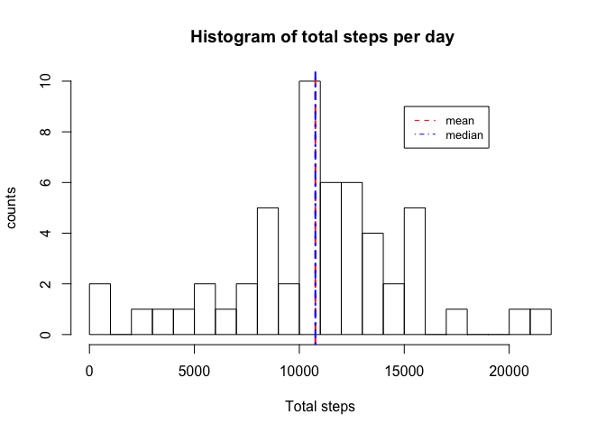
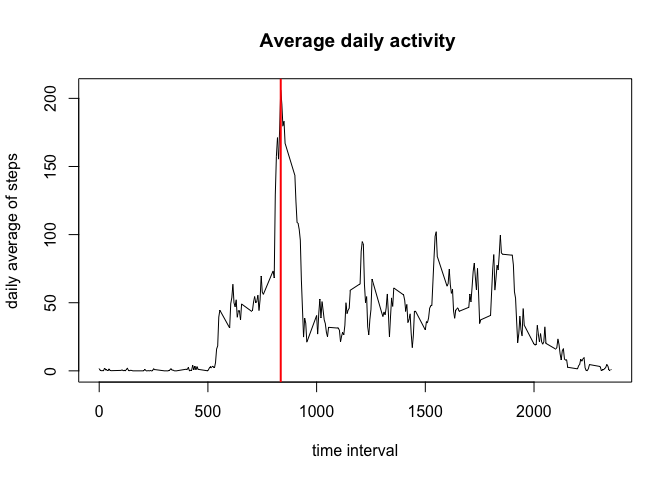
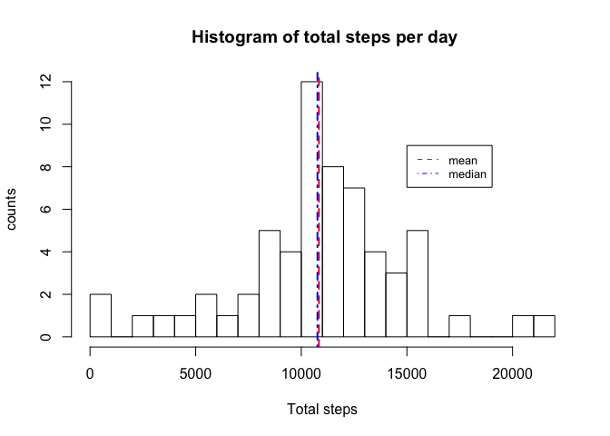
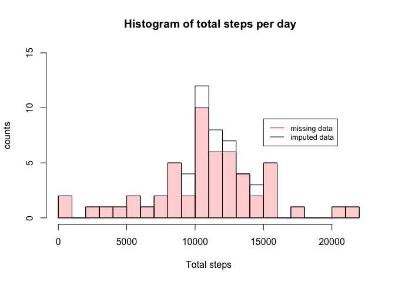
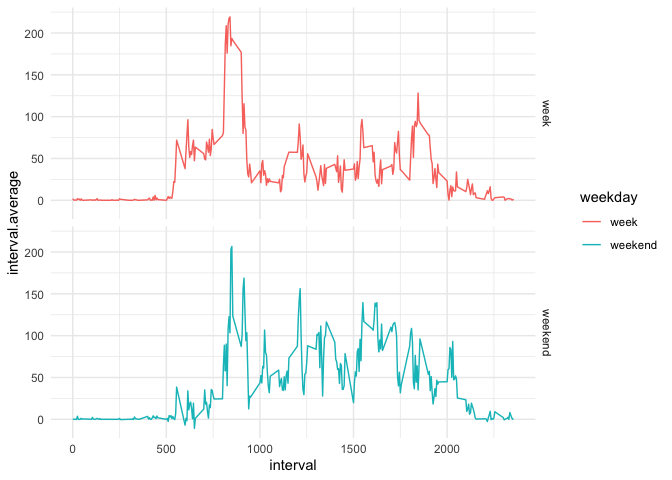

## Loading and preprocessing the data

To read the compressed file, I will use the r-package *readr*. 


```r
library(readr)
library(ggplot2)
data = read_csv(unzip("activity.zip", "activity.csv"))
```

```
## 
## ── Column specification ────────────────────────────────────────────────────────
## cols(
##   steps = col_double(),
##   date = col_date(format = ""),
##   interval = col_double()
## )
```

```r
summary(data)
```

```
##      steps             date               interval     
##  Min.   :  0.00   Min.   :2012-10-01   Min.   :   0.0  
##  1st Qu.:  0.00   1st Qu.:2012-10-16   1st Qu.: 588.8  
##  Median :  0.00   Median :2012-10-31   Median :1177.5  
##  Mean   : 37.38   Mean   :2012-10-31   Mean   :1177.5  
##  3rd Qu.: 12.00   3rd Qu.:2012-11-15   3rd Qu.:1766.2  
##  Max.   :806.00   Max.   :2012-11-30   Max.   :2355.0  
##  NA's   :2304
```

## What is mean total number of steps taken per day?

To assess the question, we need to group the data by day. I create a new grouped data frame named **totsteps** with the total number of steps per day. I also calculate the mean and median, and report the values in the histogram of the total number of steps per day. 


```r
library(dplyr)
```

```
## 
## Attaching package: 'dplyr'
```

```
## The following objects are masked from 'package:stats':
## 
##     filter, lag
```

```
## The following objects are masked from 'package:base':
## 
##     intersect, setdiff, setequal, union
```

```r
days = group_by(data,date)
totsteps = days %>% summarise(total.steps = sum(steps))
m1 = mean(totsteps$total.steps, na.rm = TRUE)
med1 = median(totsteps$total.steps, na.rm = TRUE)

hist(totsteps$total.steps, breaks = 20,
     main = " Histogram of total steps per day", 
     xlab = "Total steps", ylab = "counts")
abline(v = m1, col = 2, lty = 2, lwd = 2)
abline(v = med1, col = 4, lty = 4, lwd = 2)
legend(1.5e4, 9, legend=c("mean", "median"),
       col=c("red", "blue"), lty=c(2,4), cex=0.8)
```

<!-- -->

## What is the average daily activity pattern?

In this section, I group the data by interval, and calculate the average number of steps in each interval across all days.  
I report the time-series plot, with a vertical line marking the interval at which the averaged number of steps was maximum. 


```r
dat2 = group_by(data,interval) %>% 
      summarise(interval.average = mean(steps,na.rm = TRUE))

plot(dat2$interval,dat2$interval.average, type = "l",
     main = " Average daily activity", 
     xlab = "time interval", ylab = "daily average of steps")

maxint = dat2$interval[which.max(dat2$interval.average)]
abline(v = maxint, col = 2, lwd = 2)
```

<!-- -->

```r
print(paste("The interval with maximum averaged number of steps is",as.character(maxint)) , sep = "" )
```

```
## [1] "The interval with maximum averaged number of steps is 835"
```

## Imputing missing values

Missing values in this data set corresponds to about 13% of the data. Up to now we have ignored the missing data to do our analysis.  
Now, we will imput the missing values a finite value.  
The rule I will use in this case will be to assign a random value from a nomal distribution with a mean of that time interval averaged over all days, and corresponding standard deviation. 


```r
nrow(data[is.na(data$steps),])/nrow(data)
```

```
## [1] 0.1311475
```

```r
dat3 = group_by(data,interval) %>% 
      summarise(interval.var = var(steps,na.rm = TRUE))

imputed_values = data

for (i in seq(1, nrow(data))) {
  if(is.na(data$steps[i])==TRUE){
          myinterval = data$interval[i]
          mymean = dat2[dat2$interval == myinterval,]$interval.average
          mystd = sqrt(dat3[dat3$interval == myinterval,]$interval.var)
          imputed_values$steps[i] = rnorm(1,mymean,mystd)
  }
}
```

Now, I will recreate the original histogram using the new data set with imputed values. 


```r
days_imputed = group_by(imputed_values,date)
totsteps_imputed = days_imputed %>% summarise(total.steps = sum(steps))
m2 = mean(totsteps_imputed$total.steps, na.rm = TRUE)
med2 = median(totsteps_imputed$total.steps, na.rm = TRUE)

hist(totsteps_imputed$total.steps, breaks = 20,
     main = " Histogram of total steps per day", 
     xlab = "Total steps", ylab = "counts")
abline(v = m2, col = 2, lty = 2, lwd = 2)
abline(v = med2, col = 4, lty = 4, lwd = 2)
legend(1.5e4, 9, legend=c("mean", "median"),
       col=c("red", "blue"), lty=c(2,4), cex=0.8)
```

<!-- -->

The differences with the original histogram can be seen in the histogram below:


```r
hist(totsteps$total.steps, breaks = 20,
     ylim = c(0,15),col = rgb(1,0,0,0.2),
     main = " Histogram of total steps per day", 
     xlab = "Total steps", ylab = "counts")
hist(totsteps_imputed$total.steps,breaks = 20,add = TRUE)
legend(1.5e4, 9, legend=c("missing data", "imputed data"),
       col=c("red", "black"), lty = 1, cex=0.8)
```

<!-- -->

## Are there differences in activity patterns between weekdays and weekends?

In this section I will generate a new factor variable called **weekday** with two levels: *week* and *weekend*. I will assign every date a label using the function **weekdays()**.  

In order to observe any pattern differences between week and weekend days, I group the imputed missing values data set by weekday, and average the number of steps in each interval over all days. The plot below shows the two trends. 


```r
imputed_values$weekday = weekdays(imputed_values$date)

imputed_values$weekday[imputed_values$weekday=="Saturday"] = "weekend"
imputed_values$weekday[imputed_values$weekday=="Sunday"] = "weekend"
imputed_values$weekday[imputed_values$weekday!="weekend"] = "week"
imputed_values$weekday = as.factor(imputed_values$weekday)

byweek = group_by(imputed_values,interval,.add=TRUE) %>% group_by(weekday,.add = TRUE) %>%
      summarise(interval.average = mean(steps))
```

```
## `summarise()` has grouped output by 'interval'. You can override using the `.groups` argument.
```

```r
ggplot(byweek,aes(interval, interval.average,color=weekday)) + 
  geom_line() + facet_grid(weekday~.)+
  theme_minimal()
```

<!-- -->

```r
mean(byweek[byweek$weekday=="weekend",]$interval.average)
```

```
## [1] 42.13302
```

```r
mean(byweek[byweek$weekday=="week",]$interval.average)
```

```
## [1] 36.01506
```

We can appreciate two main differences:

 1. Week days *start* and *end* before
 2. The maximum number of steps in a single interval is higher during weekdays. However, 
 weekends are more spread, and the average of the number of steps during weekends is higher than during week days. 
